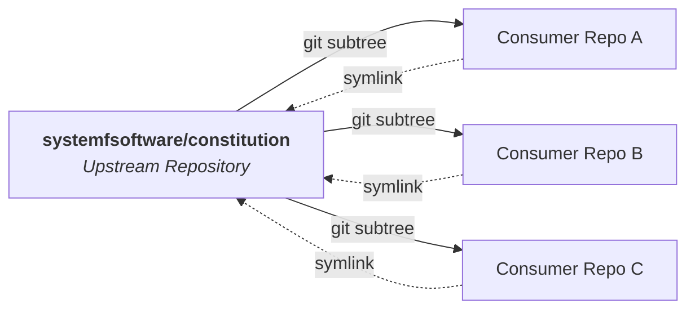

# Constitution

[](LICENSE)
[](https://systemfsoftware.com/constitution)
[](CONSTITUTION.md)

Shared engineering laws for repositories at [System F Software](https://systemfsoftware.com).

It sets baseline requirements for clean code: a pure functional core behind a thin imperative shell, domain types before logic, mutation testing for decisions, and deleting code before writing more. Principles are stack-neutral, so they apply to any language.



---

## Two files, two roles

The rules split into two files based on when an agent needs to see them:

```
constitution/
├── CONSTITUTION.md             # Resident: loaded on every run
└── CONSTITUTION-ARTICLES.md    # On demand: retrieved when editing source files
```

| File | Delivery | Contents | How to load it |
| :--- | :--- | :--- | :--- |
| `CONSTITUTION.md` | **Always on** | Conduct (Article V) | Include in agent context on every turn (`@CONSTITUTION.md` in `AGENTS.md` or `CLAUDE.md`) |
| `CONSTITUTION-ARTICLES.md` | **On demand** | Articles I to IV (Pure Core, Boundaries, Testing, Project Layout) | Load via tool hook or path rule when editing source code (never on read) |

Rules about conduct stay resident because nothing triggers them after a mistake happens. Craft rules (like how to structure a domain model or write a test) only need to load when someone touches source code.

---

## Quick start

Vendor the repository using `git subtree` and symlink both files to the project root:

```bash
# 1. Fetch the remote into a local ref
git fetch https://github.com/systemfsoftware/constitution.git main:refs/remotes/vendor/constitution

# 2. Add as a squashed subtree
git subtree add --prefix=vendor/constitution refs/remotes/vendor/constitution --squash \
  -m "chore: vendor shared constitution"

# 3. Symlink both files to the repo root
ln -s vendor/constitution/CONSTITUTION.md CONSTITUTION.md
ln -s vendor/constitution/CONSTITUTION-ARTICLES.md CONSTITUTION-ARTICLES.md
```

If the repository is brand new, create an initial commit first (`git commit --allow-empty -m "init"`).

### Connect to your agent harness

1. Add `@CONSTITUTION.md` to `AGENTS.md` or `CLAUDE.md`.
2. Set up a path-scoped rule (`.claude/rules/` or `.cursor/rules/`) to provide `CONSTITUTION-ARTICLES.md` when editing source files.
3. Or add the marketplace and install the TTSR plugin to intercept violations during edits:
   ```bash
   omp plugin marketplace add systemfsoftware/constitution
   omp plugin install constitution@systemfsoftware-marketplace
   ```

---

## The articles

| Article | File | Mode | Core rules |
| :--- | :--- | :--- | :--- |
| **I: Pure Core** | `CONSTITUTION-ARTICLES.md` | Retrieved | Pure decisions, explicit types, tagged error variants, no `null` states. |
| **II: Boundaries** | `CONSTITUTION-ARTICLES.md` | Retrieved | Functional core / imperative shell, values for effects, decode inputs rather than casting. |
| **III: Verification** | `CONSTITUTION-ARTICLES.md` | Retrieved | Observer-fit test placement, properties by narrow grant, mutation as the measure, independent oracles, pinned published contracts. |
| **IV: Organization** | `CONSTITUTION-ARTICLES.md` | Retrieved | Organize by domain responsibility, clear naming, keep modules small. |
| **V: Conduct** | `CONSTITUTION.md` | **Always on** | Zero-appeal P0 review enforcement, fix root causes, challenge decisions before committing, remove code before adding. |

---

## Pulling updates

Pull upstream changes into the subtree without changing existing symlinks:

```bash
git subtree pull --prefix=vendor/constitution https://github.com/systemfsoftware/constitution.git main --squash \
  -m "chore: update shared constitution"
```

---

## Machine validation

Every rule is defined in structured YAML:

```yaml
- id: CONST-S4
  title: Subtract Before You Add
  gate: review
  do: treat every line as a liability — removal is the default response to slop
  dont: extend a copy-paste cluster; patch around a rotten core
  harm: the codebase only grows; rot survives every patch and regrows
  check: review reads the net line delta; fixes that leave root violations are rejected
```

Run the validator to check rule IDs, schema compliance, and references across both files:

```bash
deno task test
```

---

## Contributing

Amendments need a written explanation, a version bump, and updates to consuming repos. See [AGENTS.md](AGENTS.md) for commit standards and testing guidelines.

## License

[Apache-2.0](LICENSE) (c) 2026 Ryan Lee.
